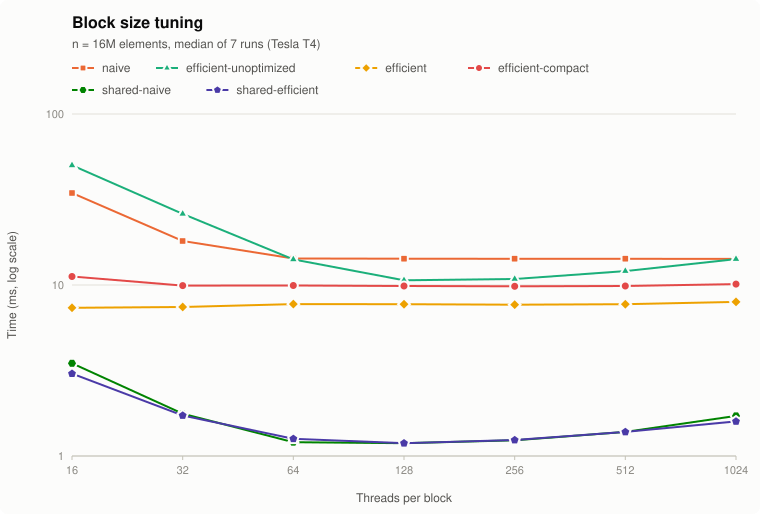
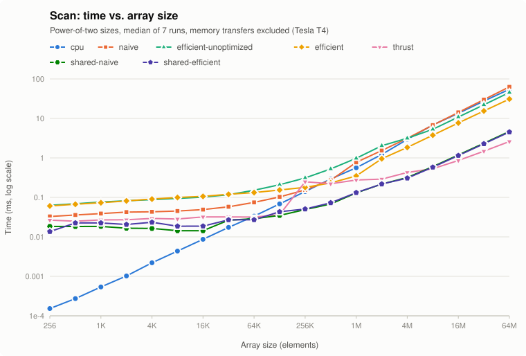
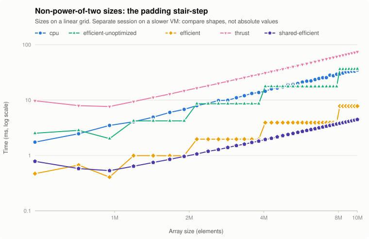
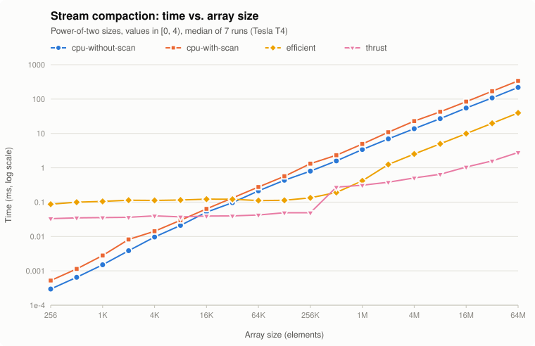
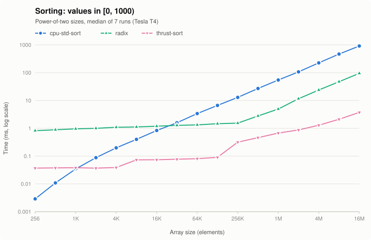
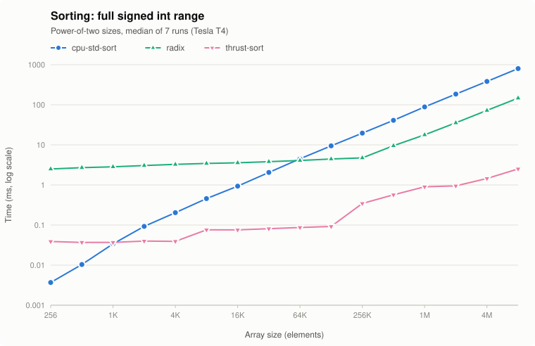
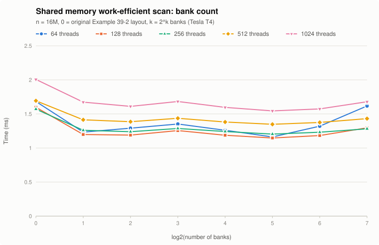

CUDA Stream Compaction
======================

**University of Pennsylvania, CIS 565: GPU Programming and Architecture, Project 2**

* (TODO) YOUR NAME HERE
  * (TODO) [LinkedIn](), [personal website](), [twitter](), etc.
* Tested on: Ubuntu 22.04.5 LTS, Intel Xeon @ 2.30GHz (4 vCPUs), 15 GB RAM, NVIDIA Tesla T4 16 GB (Google Cloud VM), CUDA 13.3, driver 610.57

## Overview

Scan (prefix sum) and stream compaction on the CPU and GPU, written from scratch in CUDA,
plus the extra credit: an optimized work-efficient scan (Part 5), a GPU radix sort, and
shared memory scans from GPU Gems 3 Chapter 39 tuned for this card.

### Features

* **CPU**: `scan`, `compactWithoutScan`, `compactWithScan` (map, scan, scatter).
* **Naive GPU scan**: `ilog2ceil(n)` kernel launches over two ping-pong buffers.
* **Work-efficient GPU scan**: in-place up-sweep / down-sweep on a zero-padded power-of-two buffer.
* **Work-efficient GPU compaction**: `kernMapToBoolean`, the device-side scan, `kernScatter`.
* **Thrust**: `exclusive_scan`, plus `remove_if` compaction and `thrust::sort` as comparison points.
* **Extra credit, Part 5**: the work-efficient scan only launches threads for nodes that do work
  (`Efficient::scan`). The slides version is kept as `Efficient::scanUnoptimized` for comparison.
* **Extra credit 1, radix sort** (`stream_compaction/radix.*`): stable LSD radix sort built on the
  work-efficient scan. It handles negative numbers and skips bits that are the same in every element.
* **Extra credit 2, shared memory** (`stream_compaction/shared_memory.*`): GPU Gems Examples 39-1
  and 39-2 in dynamic shared memory, joined across blocks with the block-sum method from 39.2.4,
  with the bank-conflict-free layout from 39.2.3. Block size and bank count are tuned for the T4
  using its occupancy numbers.
* **Testing**: the original tests plus shared memory, Thrust compaction, and radix sort tests; a
  `--stress` mode that checks every implementation against `std::partial_sum` / `std::copy_if` /
  `std::sort` on 61 sizes (1 to 4M) and many launch configurations (3,897 checks); and a `--bench`
  mode that writes the CSVs behind the charts below.

## Implementation notes

A few things that aren't obvious from the instructions:

* **Nested timers throw.** `compactWithScan` can't call `CPU::scan`, and `Efficient::compact` can't
  call `Efficient::scan`, because starting a timer that's already running throws. Both modules use
  an untimed helper (`prefixSum`, `Efficient::scanDevice`). `scanDevice` also works directly on
  device memory, so compaction and radix sort never round-trip through the host.
* **Exclusive vs. inclusive.** The naive algorithm (and Example 39-1) computes an inclusive scan.
  Uploading the input shifted right by one (`[0, x0, ..., x(n-2)]`) makes the result exclusive at no cost.
* **Padding.** `cudaMalloc` doesn't clear memory, so the extra elements in the work-efficient
  scan's power-of-two buffer are explicitly set to 0 before the timer starts.
* **GPU Gems errata** (beyond the patch images in `INSTRUCTION.md`):
  * Example 39-1 writes `temp[pout*n+thid] += temp[pin*n+thid-offset]`. With ping-pong buffers
    that adds to a value from two passes ago, and to uninitialized memory on the first pass. It
    has to be `temp[pout] = temp[pin] + temp[pin - offset]`.
  * Listing 39-3's online `CONFLICT_FREE_OFFSET` shifts by `NUM_BANKS` instead of
    `LOG_NUM_BANKS` and has no parentheses, so `+` binds before `>>`. The intended offset is
    `(i >> LOG_NUM_BANKS) + (i >> (2 * LOG_NUM_BANKS))`.
* **Compaction count** is `indices[n-1] + bools[n-1]`, read back with two single-int copies.

## Performance analysis

All times are medians of 7 runs after a warm-up call, from a Release build, with
host/device memory transfers left out of the timed region. Each implementation is measured by its
own `PerformanceTimer` (`std::chrono` for CPU code, CUDA events for GPU code). Reproduce with:

```
./build/bin/cis5650_stream_compaction_test --bench scan 26 > perf/data/scan.csv   # also: compact, sort, blocksize, banks, occupancy
python3 perf/plot.py
```

### Block size tuning



The T4 runs 32 threads per warp and 1024 threads per streaming multiprocessor (SM), with at most
16 active blocks per SM (queried with `cudaDeviceGetAttribute` and
`cudaOccupancyMaxActiveBlocksPerMultiprocessor`). Blocks of 16 or 32 threads can only fill 256 or
512 of an SM's 1024 thread slots. That's why every global memory kernel slows down below 64: the
naive scan takes 34.5 ms at 16 threads versus 14.2 ms at 64 and up. From 64 to 1024 the SMs
are full, and global memory timings are flat to within noise.

| Implementation | Chosen block size | Why |
|---|---|---|
| Naive | 256 | flat from 64 to 1024 (14.2 ms at 16M) |
| Work-efficient scan / compaction | 256 | the scan is flat (7.4–8.0 ms); compaction is best at 256 (9.83 ms) |
| Work-efficient, unoptimized | 128 | best at 128 (10.66 ms); every level launches all n threads, so launch overhead shows |
| Radix sort | 256 | uses the work-efficient scan |
| Shared memory (both) | 128 | best at 128 (1.19 ms); see [Extra credit 2](#extra-credit-2-shared-memory-scans-and-hardware-tuning) |

### Scan



| n | CPU | Naive | Efficient (unopt.) | Efficient | Thrust | Shared naive | Shared efficient |
|---:|---:|---:|---:|---:|---:|---:|---:|
| 65,536 | **0.033** | 0.075 | 0.151 | 0.133 | **0.032** | 0.029 | 0.027 |
| 1,048,576 | 0.564 | 0.771 | 0.979 | 0.350 | 0.276 | **0.130** | 0.132 |
| 16,777,216 | 13.49 | 14.24 | 10.84 | 7.68 | **0.86** | 1.19 | 1.15 |
| 67,108,864 | 54.75 | 63.08 | 45.45 | 31.04 | **2.60** | 4.69 | 4.53 |

Times in ms. The non-power-of-two sizes used here (2^k − 3) are within noise of the
power-of-two numbers, because they pad to the *same* power of two. That's misleading on its own;
see the stair-step below. All raw numbers are in `perf/data/scan.csv`.

**What's going on:**

* **Small arrays: the CPU wins.** A cache-friendly loop takes nanoseconds per element, while
  every GPU kernel launch costs tens of microseconds on the host no matter how little work it
  does. The work-efficient scan makes 2·log2(n) launches (32 at 65K, see the Nsight numbers
  below), so it has a ~0.06 ms floor. Below ~250K elements that overhead dominates, and every GPU
  line is roughly flat.
* **Large arrays: the bottleneck is global memory bandwidth, not computation.** The CPU and the
  global memory scans grow linearly. The naive scan does n additions per level over log2(n)
  levels, O(n log n) work that all goes through global memory. At 64M it's slower than
  the CPU. The work-efficient scan does O(n) work but still touches global memory at every level,
  so it only reaches 1.8× the CPU at 64M.
* **Shared memory changes the picture** (12× the CPU at 64M): each block's whole tree runs in
  shared memory, and global memory is only read once and written once per element per level
  of the block recursion (4 levels at 64M with 256-element blocks: 64M → 262K sums → 1K → 1 block).
* **Thrust is fastest at large sizes** (21× the CPU at 64M, 1.7× faster than the shared memory
  scan). The Nsight Systems timeline shows why: a single `thrust::exclusive_scan` is one
  `cudaMalloc` for CUB's temporary storage, **two** kernel launches (`DeviceScanInitKernel`,
  `DeviceScanKernel`), a `cudaStreamSynchronize`, and a `cudaFree`. The work-efficient scan at 1M makes
  40 launches and a memset. Thrust's kernels are also specialized per compute capability
  (`SM_750` in the kernel names).
* **Thrust's step between 131K and 262K** (0.036 → 0.25 ms, also visible in the compaction and
  sort charts) appears to come from allocation. The timed region includes allocating and freeing CUB's
  temporary storage, which took 13 µs at 65K but 214 µs at 1M, about 70% of Thrust's measured time
  there (share of the host-side span of the call). The jump is most likely where that allocation stops being cheap. Reusing a
  caching allocator would remove it.
* **First call overhead.** In the test output, the first power-of-two run of each GPU method is
  slower than the non-power-of-two run right after it. The trace shows the first launch in a
  module paying `cuLibraryLoadData` / `cuLibraryGetKernel` to load and look up the kernel.

### Non-power-of-two sizes: the padding stair-step



Both work-efficient scans round n up to the next power of two, so their cost is set by the padded
size, not by n. Sweeping sizes on a linear grid shows flat runs with a doubling at each boundary:

| n | Padded to | CPU | Efficient | Efficient (unopt.) | Shared efficient | Thrust |
|---:|---:|---:|---:|---:|---:|---:|
| 4,000,000 | 2^22 | 13.70 | 1.96 | 8.60 | 1.81 | 29.04 |
| 4,250,000 | 2^23 | 14.42 | 3.91 | 17.63 | 1.94 | 30.95 |
| jump | | 1.05× | **2.00×** | **2.05×** | 1.07× | 1.07× |

Adding 250,000 elements (6%) exactly doubles the work-efficient scan's runtime, and the same
happens at 8.25M → 8.5M (3.91 → 7.79 ms). Everything that doesn't pad — the CPU, Thrust, and the
shared memory scan, which only pads the last block of each level — grows smoothly. Worst case, a
padded scan does almost twice the necessary work; picking 2^k − 3 as "the" non-power-of-two test
size hides that completely.

> The numbers in this section come from a later session, when the VM (a preemptible instance)
> was running with about 5× less memory bandwidth, so the CPU and Thrust values here are inflated
> and **not** comparable to the tables above. The comparison that matters is within this one
> session: the ratios at the boundary. GPU-side `efficient` measured the same in both sessions
> (1.96 ms vs. 1.85 ms at 4M), which is why the stair-step itself is trustworthy.

### Stream compaction



| n | CPU without scan | CPU with scan | Work-efficient | Thrust `remove_if` |
|---:|---:|---:|---:|---:|
| 65,536 | 0.213 | 0.276 | 0.111 | **0.042** |
| 1,048,576 | 3.40 | 4.92 | 0.417 | **0.310** |
| 16,777,216 | 54.85 | 84.00 | 9.89 | **1.05** |
| 67,108,864 | 218.1 | 337.8 | 39.52 | **2.79** |

On the CPU, compaction is much slower than scan (218 ms vs. 55 ms at 64M) even though it's also
one pass. With values in [0, 4), a quarter of the elements are zero at random, so the
`if (idata[i] != 0)` branch mispredicts constantly. The version with scan makes three passes and
touches two extra arrays, which makes it about 1.5× slower. On the GPU there's no branch penalty,
so the work-efficient compaction is 5.5× faster than the best CPU version at 64M. It's still 14× slower
than Thrust, because it pays for the global memory scan plus map, scatter, a device-to-device copy,
and two synchronous readbacks for the count.

### Kernel-level profiling (Nsight Compute)

`ncu -k regex:<kernel> --launch-count 1 --section SpeedOfLight --section Occupancy --section LaunchStats`
on the first (largest) launch of each kernel, at n = 2^22:

| Kernel | Block | Regs/thread | Shared/block | Grid | Waves/SM | DRAM throughput | Compute throughput |
|---|---:|---:|---:|---:|---:|---:|---:|
| `kernUpSweep` (ours, global) | 256 | 16 | 0 | 8192 | 51.2 | 80.96% | 6.42% |
| `kernEfficientScanBlock` (ours, shared) | 128 | 24 | 1.05 KB | 16384 | 51.2 | 74.06% | 55.17% |
| CUB `DeviceScanKernel` (Thrust) | 128 | 64 | 7.70 KB | 2185 | 6.83 | 79.25% | 22.35% |

All three are **memory bound**: DRAM throughput sits at 74–81% of peak while compute throughput
is far lower. That confirms the bandwidth argument above — there's no point micro-optimizing the
arithmetic. `kernUpSweep` is the extreme case: one add per thread, 6.4% compute throughput,
and it still saturates DRAM.

The interesting difference is **waves per SM**: our kernels launch 51.2 waves of blocks to cover
the array, CUB only 6.83. CUB's kernel uses 64 registers and 7.7 KB of shared memory per block to
process many elements per thread (a serial scan in registers, then a block scan — the technique
from 39.2.5), so it moves the same data with far fewer blocks and one pass over memory. Our
work-efficient scan re-reads and re-writes the whole array once per level instead.

Theoretical occupancy is 100% for all three. Occupancy isn't the limiter here; the number of
passes over global memory is.

## Extra credit, Part 5: why the "efficient" scan is slow

Written straight from the slides, each level launches a thread for **every** element, and each
thread checks `k % stride == 0`. At level d only n / 2^(d+1) threads do anything. By the
middle of the tree more than 99% of launched threads just take the modulo, fail, and exit,
and every launch still costs work for all n threads.

The fix (`kernUpSweep` / `kernDownSweep` in `efficient.cu`) launches only `n >> (d+1)`
threads per level. Thread `i` computes its node directly: `right = (i + 1) * stride - 1`,
`left = right - stride / 2`. Deep levels, which have only a handful of nodes, launch a partial
block instead of a full one. The algorithm and the data layout don't change.

| n | CPU | Unoptimized | Optimized | Speedup |
|---:|---:|---:|---:|---:|
| 1,048,576 | 0.564 | 0.979 | **0.350** | 2.8× |
| 16,777,216 | 13.49 | 10.84 | **7.68** | 1.4× |
| 67,108,864 | 54.75 | 45.45 | **31.04** | 1.5× |

The unoptimized version only beats the CPU above ~4M elements. The optimized one beats it from
~512K. The gain is largest in the middle range, where launching n idle threads per level is a
big share of the total.

## Extra credit 1: radix sort

`StreamCompaction::Radix::sort(int n, int *odata, const int *idata)` follows GPU Gems 3,
39.3.3. For each bit: map the elements that go first (`e`), scan `e` with the work-efficient
`scanDevice` to get `f`, compute `totalFalses = f[n-1] + e[n-1]`, and scatter each element to
`f[i]` or `i - f[i] + totalFalses`. `e` is recomputed inside the scatter kernel instead of
being stored.

* **Negative numbers**: for bit 31 the order flips (1s go first), so the result matches
  `std::sort` for any `int`. The sign bit is always the last pass.
* **Skipping useless passes**: one GPU reduction computes the OR of `x[i] ^ x[0]`, which gives
  exactly the bits that differ somewhere in the array. A bit that's the same everywhere can't
  change the order, so its pass is skipped. Values in [0, 1000) take 10 passes instead of 32.

```cpp
#include <stream_compaction/radix.h>

int in[]  = { 5, -3, 12, 0, -3, 7 };
int out[6];
StreamCompaction::Radix::sort(6, out, in);   // out = { -3, -3, 0, 5, 7, 12 }
```

Example from the test program (n = 256, full int range):

```
    [ -808342457 1228656350 326580026 -1369919188 -654292312 -1787459513 894281802 1863014032 -1795478269 1485445697 241219246 -415778814 -4597352 ... 1390163589 602746635 ]
==== radix sort, negative numbers, power-of-two ====
   elapsed time: 2.71222ms    (CUDA Measured)
    [ -2143091459 -2137397623 -2120404722 -2103568261 -2093722487 -2082896888 -2057648034 -2008565393 -2005573409 -1991877700 -1984606944 -1970850850 -1959455179 ... 2109636764 2146536165 ]
    passed
```




| n | values | `std::sort` | Radix (GPU) | `thrust::sort` |
|---:|---|---:|---:|---:|
| 1,048,576 | [0, 1000) | 54.6 | 4.94 | **0.67** |
| 16,777,216 | [0, 1000) | 912.7 | 94.9 | **3.73** |
| 1,048,576 | any int | 88.8 | 17.8 | **0.90** |
| 8,388,608 | any int | 801.6 | 146.7 | **2.52** |

The radix sort is 5–11× faster than `std::sort` for large arrays (more for small value ranges, which need fewer passes), but far slower than
`thrust::sort` (CUB's radix sort). Every pass pays for a full global memory scan plus two
synchronous readbacks, while CUB does whole passes in a few kernels. (The full-range benchmark
stops at 8M; the 16M run was cut off when the VM restarted.)

## Extra credit 2: shared memory scans and hardware tuning

`SharedMemory::naiveScan` (Example 39-1) and `SharedMemory::efficientScan` (Example 39-2) run each
thread block's whole scan in dynamic shared memory (`extern __shared__ int temp[]`, sized by the
third launch parameter) with `__syncthreads()` between levels. To handle any n (39.2.4), each
level scans all blocks in one launch and writes each block's total to a sums array. The sums are
scanned the same way until they fit in one block, and then one add kernel per level applies each
block's offset. Every level's buffers are allocated before the timer starts.

**Occupancy.** Measured on the T4 with `cudaOccupancyMaxActiveBlocksPerMultiprocessor`:

| Threads per block | 2–64 | 128 | 256 | 512 | 1024 |
|---|---:|---:|---:|---:|---:|
| Max active blocks per SM | 16 | 8 | 4 | 2 | 1 |

The T4 has 64 KB of shared memory per SM and allows 48 KB per block. These kernels use only 2 ints
per thread (8 KB per block at 1024 threads), so shared memory never becomes the limit. The limit
is warps: 1024 threads per SM over 32-thread warps. Blocks of 64 or more fill the SM, and larger
blocks just mean deeper trees and more `__syncthreads()` rounds per block (log2 B). 128 threads
turned out best for both kernels (about 1.19 ms at 16M, versus 3.0–3.5 ms at 16 and 1.6–1.7 ms at 1024).
If a kernel asked for the full 48 KB per block, occupancy would drop to 1 block per SM at any block size.

**Bank conflicts (39.2.3).** Threads that stride through the tree at the same level access
addresses in the same shared memory bank, and those accesses get serialized. The fix loads each
thread's two elements from the two halves of the block instead of adjacent slots, and leaves a
gap every `NUM_BANKS` slots (`bankSlot` in `shared_memory.cu`). The chapter used 16 banks, the
half-warp of 8-Series cards. This card's warp is 32, so I swept the bank count:



32 banks (`logNumBanks = 5`) is the fastest setting at every block size. At 128 threads it takes
1.147 ms, versus 1.598 ms for the original Example 39-2 layout: **28% faster** from
indexing alone. 16 banks gets most of the way there (1.187 ms), and 128 banks starts to hurt
again, presumably because a gap only every 128 slots is too sparse to push neighboring threads' accesses into different banks.

## Test output

`./build/bin/cis5650_stream_compaction_test` with the default `SIZE = 1 << 8`. Tests added beyond
the original ones: shared memory scans, Thrust compaction, and the whole radix sort section.
`--stress` is also new:

```
Stress testing 61 sizes (largest 4194311)...
3897 checks, 0 failures: all passed
```

```
****************
** SCAN TESTS **
****************
    [  26   3  46  34  44  16  25  10  17  10  27  27  32 ...  27   0 ]
==== cpu scan, power-of-two ====
   elapsed time: 0.000501ms    (std::chrono Measured)
    [   0  26  29  75 109 153 169 194 204 221 231 258 285 ... 6078 6105 ]
==== cpu scan, non-power-of-two ====
   elapsed time: 0.000195ms    (std::chrono Measured)
    [   0  26  29  75 109 153 169 194 204 221 231 258 285 ... 6036 6050 ]
    passed 
==== naive scan, power-of-two ====
   elapsed time: 0.184576ms    (CUDA Measured)
    passed 
==== naive scan, non-power-of-two ====
   elapsed time: 0.034816ms    (CUDA Measured)
    passed 
==== work-efficient scan, power-of-two ====
   elapsed time: 0.288768ms    (CUDA Measured)
    passed 
==== work-efficient scan, non-power-of-two ====
   elapsed time: 0.061504ms    (CUDA Measured)
    passed 
==== thrust scan, power-of-two ====
   elapsed time: 0.093728ms    (CUDA Measured)
    passed 
==== thrust scan, non-power-of-two ====
   elapsed time: 0.032768ms    (CUDA Measured)
    passed 
==== shared memory naive scan, power-of-two ====
   elapsed time: 0.256ms    (CUDA Measured)
    passed 
==== shared memory naive scan, non-power-of-two ====
   elapsed time: 0.02048ms    (CUDA Measured)
    passed 
==== shared memory work-efficient scan, power-of-two ====
   elapsed time: 0.053856ms    (CUDA Measured)
    passed 
==== shared memory work-efficient scan, non-power-of-two ====
   elapsed time: 0.015872ms    (CUDA Measured)
    passed 

*****************************
** STREAM COMPACTION TESTS **
*****************************
    [   0   3   2   2   0   2   3   0   3   0   3   3   0 ...   1   0 ]
==== cpu compact without scan, power-of-two ====
   elapsed time: 0.001524ms    (std::chrono Measured)
    [   3   2   2   2   3   3   3   3   2   1   3   3   1 ...   2   1 ]
    passed 
==== cpu compact without scan, non-power-of-two ====
   elapsed time: 0.001016ms    (std::chrono Measured)
    [   3   2   2   2   3   3   3   3   2   1   3   3   1 ...   3   2 ]
    passed 
==== cpu compact with scan ====
   elapsed time: 0.002183ms    (std::chrono Measured)
    [   3   2   2   2   3   3   3   3   2   1   3   3   1 ...   2   1 ]
    passed 
==== work-efficient compact, power-of-two ====
   elapsed time: 0.292064ms    (CUDA Measured)
    passed 
==== work-efficient compact, non-power-of-two ====
   elapsed time: 0.10352ms    (CUDA Measured)
    passed 
==== thrust compact, power-of-two ====
   elapsed time: 0.174624ms    (CUDA Measured)
    passed 
==== thrust compact, non-power-of-two ====
   elapsed time: 0.0496ms    (CUDA Measured)
    passed 

**********************
** RADIX SORT TESTS **
**********************
    [ 376 903 446 534 944 666 175 860 167 160 427 127 332 ... 877 575 ]
==== cpu std::sort, power-of-two ====
   elapsed time: 0.012098ms    (std::chrono Measured)
    [   7   7   8   9  10  12  17  19  29  31  32  35  36 ... 980 992 ]
==== radix sort, power-of-two ====
   elapsed time: 1.20982ms    (CUDA Measured)
    [   7   7   8   9  10  12  17  19  29  31  32  35  36 ... 980 992 ]
    passed 
==== thrust sort, power-of-two ====
   elapsed time: 0.11472ms    (CUDA Measured)
    passed 
==== radix sort, non-power-of-two ====
   elapsed time: 0.923968ms    (CUDA Measured)
    [   7   7   8   9  10  12  17  19  29  31  32  35  36 ... 980 992 ]
    passed 
    [ -808342457 1228656350 326580026 -1369919188 -654292312 -1787459513 894281802 1863014032 -1795478269 1485445697 241219246 -415778814 -4597352 ... 1390163589 602746635 ]
==== radix sort, negative numbers, power-of-two ====
   elapsed time: 2.71222ms    (CUDA Measured)
    [ -2143091459 -2137397623 -2120404722 -2103568261 -2093722487 -2082896888 -2057648034 -2008565393 -2005573409 -1991877700 -1984606944 -1970850850 -1959455179 ... 2109636764 2146536165 ]
    passed 
==== radix sort, negative numbers, non-power-of-two ====
   elapsed time: 2.648ms    (CUDA Measured)
    passed 
```

## Build notes

* **CMake changes beyond the source lists:** `stream_compaction/CMakeLists.txt` had
  `set_target_properties(stream_compaction} ...` in the branch for CMake < 3.23. The stray `}`
  makes configure fail on CMake 3.22 (Ubuntu 22.04's version), so I removed it. Everything else
  is additions to source lists: `radix.*`, `shared_memory.*`, and `src/perf.*`.
* CUDA 13 moved Thrust and CUB to `include/cccl`. nvcc still finds them, so no changes were needed.
* `system("pause")` only runs on Windows now. On Linux it just printed `sh: pause: not found`.
* Command line: `cis5650_stream_compaction_test [log2 size]`, `--stress`, or
  `--bench <scan|compact|sort|blocksize|banks|occupancy|all> [max log2 size]`.
